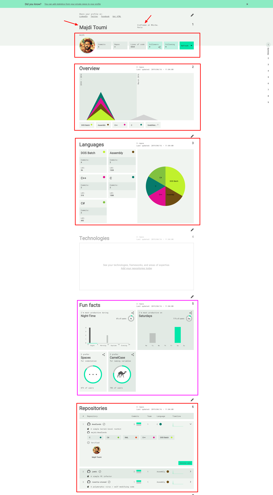
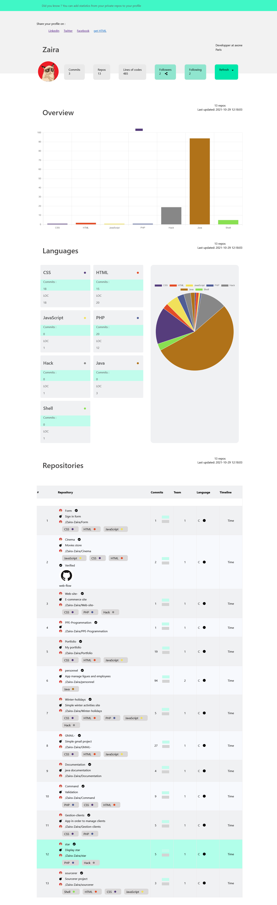

# Project Sourcerer

This project is about visual profile for software engineer

## About the project

The goal of the project is to make a copycat of.... Sourcerer !

The website first usecase is to simply consume Github API to display data

We have to display user data by using GraphQL Github API and Apollo Client

## Features

Here is the screen ob website design to display. 

Everything in red is MANDATORY and ROSE is optionnal 

## Overview  of my work 

### Rules 

We have to return the project on Tuesday November, 9 at 23:42 pm by sending an MP on discord with the link of my github repo.
